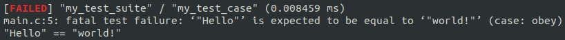

Rexo
====

Rexo is a neat unit testing framework for C and C++.

It offers the same xUnit-like structure than most other unit testing frameworks
but aims at providing a _truly_ polished API.


## Features

* fits into a single header file.
* automatic registration of tests.
* dead simple implementation (KISS all the things!).
* no specific test runner or DWARF debug information required.
* brings a designated initializer-like syntax to all C++ versions.
* test cases can override config attributes from their respective test suite.
* diagonal (high level) API for ease of use.
* orthogonal (low level) API for granular customization.
* test fixtures with set up/tear down callbacks.
* compatible with C99 and C++.


## Requirements

The automatic registration of tests relies on a compiler-specific feature to
place data in a specific memory section. The compilers currently supported are
the GNU compilers (clang, gcc, icc) and MSVC.

Extending the automatic registration feature to other compilers should be
possible.


## Roadmap

* implement a command-line option parser.
* run each test in isolated environment (subprocess).
* add an option to set up the output format of the summary (e.g.: jUnit XML).
* more visual failure messages (e.g.: an arrow pointing where a string differs).
* support for more assertion macros (e.g.: array comparison, signal handling).


## Usage

```c
#include <rexo.h>

struct my_data {
    const char *value;
};

RX_SET_UP(my_set_up, struct my_data)
{
    RX_DATA->value = "world!";
    return RX_SUCCESS;
}

RX_FIXTURE(my_fixture, struct my_data, .set_up = my_set_up);

RX_TEST_CASE_FIXTURE(my_test_suite, my_test_case, my_fixture)
{
    RX_REQUIRE_STR_EQUAL("Hello", RX_DATA->value);
}

int
main(int argc, const char **argv)
{
    return rx_run(argc, argv, 0, NULL) == RX_SUCCESS ? 0 : 1;
}
```




## License

[MIT](https://choosealicense.com/licenses/mit)
