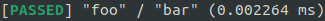
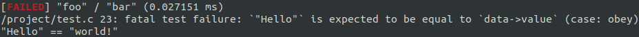

![Test][badge-test]

Rexo
====

Rexo is a neat single-file cross-platform unit testing framework for C/C++.

It offers the same [xUnit][xunit]-like structure than most other unit testing
frameworks but aims at providing a _truly_ polished API.


## Features

* **sleek**: polished API with great attention to details.
* **easy**: no learning curve, it's yet another framework based on xUnit
  with test suites, test cases, and fixtures.
* **convenient**: automatic registration of tests.
* **granular**: high level or low level API? You choose.
* **portable**: compatible with C89 (ANSI C) and C++.
* **cross-platform**: tested on Linux, macOS, and Windows.
* **simple**: straightforward implementation—KISS all the things!
* **cascading configuration**: configure a whole test suite at once and/or tweak
  specific options for each test case.
* **painless**: deployment couldn't be easier—it all fits into a single
  header file and has no external dependencies.


But also...

* fully standard compliant minus the optional automatic registration of tests
  that relies on a widespread compiler-specific feature.
* designated initializer-like syntax to all C and C++ versions.


## Roadmap

* implement a command-line option parser (e.g.: for filtering test cases).
* allow choosing the output format of the summary (e.g.: jUnit XML).
* support more assertion macros (e.g.: array comparison, signal handling).
* improve failure messages to be more visual (e.g.: an arrow pointing
  where strings differ).


## Usage

### Minimal

```c
#include <rexo.h>

RX_TEST_CASE(foo, bar)
{
    RX_INT_REQUIRE_EQUAL(2 * 3 * 7, 42);
}

int
main(int argc, const char **argv)
{
    return rx_main(0, NULL, argc, argv) == RX_SUCCESS ? 0 : 1;
}
```




### Fixture

```c
#include <rexo.h>

struct foo_data {
    const char *value;
};

RX_SET_UP(foo_set_up)
{
    struct foo_data *data;

    data = (struct foo_data *)RX_DATA;
    data->value = "world!";
    return RX_SUCCESS;
}

RX_FIXTURE(foo_fixture, struct foo_data, .set_up = foo_set_up);

RX_TEST_CASE(foo, bar, .fixture = foo_fixture)
{
    struct foo_data *data;

    data = (struct foo_data *)RX_DATA;
    RX_STR_REQUIRE_EQUAL("Hello", data->value);
}

int
main(int argc, const char **argv)
{
    return rx_main(0, NULL, argc, argv) == RX_SUCCESS ? 0 : 1;
}
```




## Documentation

<https://christophercrouzet.github.io/rexo>


## Repository

<https://github.com/christophercrouzet/rexo>


## License

[Unlicense][unlicense].


[badge-test]: https://github.com/christophercrouzet/rexo/workflows/Test/badge.svg
[unlicense]: https://unlicense.org
[xunit]: https://en.wikipedia.org/wiki/XUnit
